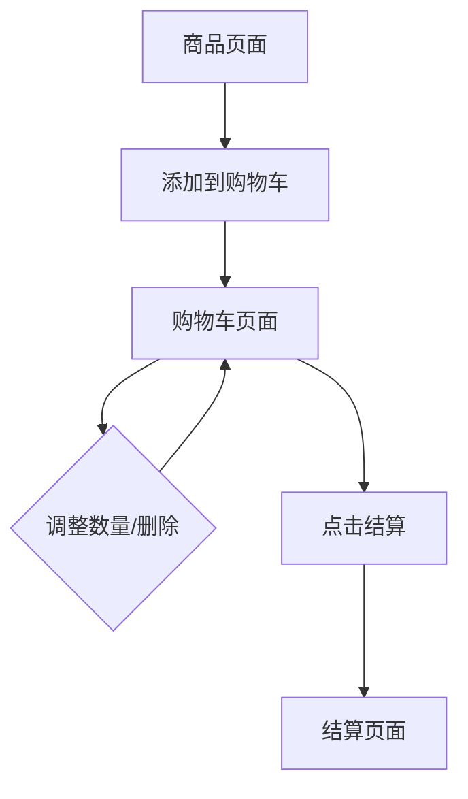

## 1. 产品概述
购物车页面是电商网站的核心功能模块，允许用户查看、管理和结算所选商品。用户可以在此页面查看商品详情、调整数量、删除商品并进行结算操作。

## 2. 核心功能

### 2.1 用户角色
| 角色 | 注册方式 | 核心权限 |
|------|----------|----------|
| 普通用户 | 邮箱注册 | 添加商品到购物车、修改数量、删除商品、结算 |
| 访客用户 | 无需注册 | 添加商品到购物车、修改数量、删除商品 |

### 2.2 功能模块
购物车页面包含以下核心功能：
1. **购物车页面**：商品列表展示、数量调整、删除操作、总价计算、结算按钮
2. **空购物车页面**：当购物车为空时显示友好提示和推荐商品

### 2.3 页面详情
| 页面名称 | 模块名称 | 功能描述 |
|----------|----------|----------|
| 购物车页面 | 商品列表 | 展示购物车中所有商品，包含商品图片、名称、价格、数量选择器 |
| 购物车页面 | 数量调整 | 通过步进器或输入框调整商品购买数量，实时更新小计和总价 |
| 购物车页面 | 删除操作 | 提供删除按钮移除单个商品或清空整个购物车 |
| 购物车页面 | 价格计算 | 实时计算每个商品的小计和购物车总价 |
| 购物车页面 | 结算按钮 | 跳转到结算页面，显示选中商品的总金额 |
| 空购物车页面 | 空状态提示 | 显示购物车为空的友好提示信息和图标 |
| 空购物车页面 | 推荐商品 | 展示热门或相关推荐商品，引导用户继续购物 |

## 3. 核心流程
用户操作流程：
1. 用户浏览商品并添加到购物车
2. 点击购物车图标进入购物车页面
3. 查看商品列表，可调整数量或删除商品
4. 确认商品信息后点击结算按钮
5. 进入结算流程完成购买

## 4. 用户界面设计

### 4.1 设计风格
- **主色调**：蓝色系（#1890ff）作为主色，灰色系作为辅助色
- **按钮样式**：圆角矩形按钮，主要操作为实心填充，次要操作为边框样式
- **字体**：系统默认字体，标题16px，正文14px，辅助文字12px
- **布局风格**：卡片式布局，商品信息清晰分区
- **图标风格**：使用Ant Design内置图标，保持风格统一

### 4.2 页面设计概述
| 页面名称 | 模块名称 | UI元素 |
|----------|----------|--------|
| 购物车页面 | 商品卡片 | 左侧商品图片（80x80px），右侧商品信息垂直排列，包含名称、规格、价格、数量选择器 |
| 购物车页面 | 操作区域 | 底部固定栏显示总价和结算按钮，背景为白色，有阴影效果 |
| 购物车页面 | 空状态 | 居中显示大图标（购物车图标），下方显示提示文字和继续购物按钮 |

### 4.3 响应式设计
采用桌面端优先设计，适配不同屏幕尺寸：
- 桌面端：商品信息横向排列，操作按钮在右侧
- 平板端：适当缩小图片尺寸，保持布局结构
- 移动端：商品信息垂直排列，操作按钮在底部