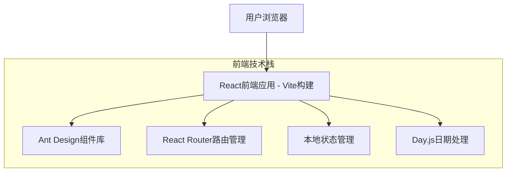

## 1. 架构设计



## 2. 技术栈描述

- **前端**: React@18 + Ant Design@5 + Vite@5
- **初始化工具**: vite-init
- **路由管理**: react-router-dom@6
- **日期处理**: dayjs
- **构建工具**: Vite（替代传统CDN引入）
- **状态管理**: React Hooks (useState/useEffect)
- **后端**: 无（纯前端实现）

## 3. 项目结构

```
shopping-cart/
├── src/
│   ├── components/          # 可复用组件
│   │   ├── CartItem.jsx
│   │   ├── QuantitySelector.jsx
│   │   ├── EmptyCart.jsx
│   │   └── PriceDisplay.jsx
│   ├── pages/               # 页面组件
│   │   ├── CartPage.jsx
│   │   └── EmptyCartPage.jsx
│   ├── hooks/               # 自定义Hooks
│   │   └── useCart.js
│   ├── utils/               # 工具函数
│   │   ├── storage.js
│   │   └── price.js
│   ├── App.jsx              # 主应用组件
│   ├── main.jsx             # 应用入口文件
│   └── index.css            # 全局样式
├── public/                  # 静态资源
├── package.json             # 项目依赖配置
├── vite.config.js           # Vite构建配置
└── README.md                # 项目说明
```

## 4. 路由定义

| 路由 | 用途 | 组件 |
|------|------|------|
| / | 购物车主页面，展示商品列表和操作功能 | CartPage |
| /empty | 空购物车页面，显示友好提示 | EmptyCartPage |

### 4.1 路由配置示例
```jsx
// App.jsx
import { BrowserRouter, Routes, Route } from 'react-router-dom'
import CartPage from './pages/CartPage'
import EmptyCartPage from './pages/EmptyCartPage'

function App() {
  return (
    <BrowserRouter>
      <Routes>
        <Route path="/" element={<CartPage />} />
        <Route path="/empty" element={<EmptyCartPage />} />
      </Routes>
    </BrowserRouter>
  )
}
```

## 5. 依赖配置

### 5.1 核心依赖 (package.json)
```json
{
  "dependencies": {
    "react": "^18.2.0",
    "react-dom": "^18.2.0",
    "react-router-dom": "^6.8.0",
    "antd": "^5.0.0",
    "dayjs": "^1.11.0"
  },
  "devDependencies": {
    "@vitejs/plugin-react": "^4.0.0",
    "vite": "^5.0.0"
  }
}
```

### 5.2 Vite配置 (vite.config.js)
```js
import { defineConfig } from 'vite'
import react from '@vitejs/plugin-react'

export default defineConfig({
  plugins: [react()],
  server: {
    port: 3000,
    open: true
  },
  build: {
    outDir: 'dist',
    sourcemap: true
  }
})
```

## 6. 数据类型定义

### 6.1 TypeScript类型定义
```typescript
// 购物车商品项类型
type CartItem = {
  id: string;
  name: string;
  price: number;
  quantity: number;
  image: string;
  spec?: string;
  addedAt?: string; // 使用dayjs格式化的时间
}

// 购物车状态
type CartState = {
  items: CartItem[];
  total: number;
  isEmpty: boolean;
  itemCount: number;
}
```

### 6.2 本地存储管理
```typescript
// src/utils/storage.js
const CART_STORAGE_KEY = 'shopping-cart-items';

export const saveCartToStorage = (items) => {
  localStorage.setItem(CART_STORAGE_KEY, JSON.stringify(items));
};

export const loadCartFromStorage = () => {
  const stored = localStorage.getItem(CART_STORAGE_KEY);
  return stored ? JSON.parse(stored) : [];
};

export const clearCartStorage = () => {
  localStorage.removeItem(CART_STORAGE_KEY);
};
```

## 7. 组件架构

### 7.1 自定义Hook (useCart.js)
```jsx
import { useState, useEffect } from 'react'
import { loadCartFromStorage, saveCartToStorage } from '../utils/storage'
import { calculateTotal, calculateItemSubtotal } from '../utils/price'

export const useCart = () => {
  const [items, setItems] = useState([])
  const [total, setTotal] = useState(0)

  useEffect(() => {
    const loadedItems = loadCartFromStorage()
    setItems(loadedItems)
    setTotal(calculateTotal(loadedItems))
  }, [])

  const updateQuantity = (id, quantity) => {
    const updatedItems = items.map(item =>
      item.id === id ? { ...item, quantity } : item
    )
    setItems(updatedItems)
    setTotal(calculateTotal(updatedItems))
    saveCartToStorage(updatedItems)
  }

  const removeItem = (id) => {
    const updatedItems = items.filter(item => item.id !== id)
    setItems(updatedItems)
    setTotal(calculateTotal(updatedItems))
    saveCartToStorage(updatedItems)
  }

  return { items, total, updateQuantity, removeItem }
}
```

### 7.2 主要组件结构
- **CartPage**: 购物车主页面组件，使用useCart Hook管理状态
- **CartItem**: 单个商品项展示组件，接收item数据和操作函数
- **QuantitySelector**: 数量选择器组件，使用Ant Design InputNumber
- **EmptyCartPage**: 空购物车页面组件，使用Ant Design Empty组件
- **CartSummary**: 购物车结算栏组件，固定在页面底部

## 8. Ant Design组件集成

### 8.1 主要使用的组件
- **Card**: 商品卡片容器，展示商品信息
- **Button**: 操作按钮，支持danger、primary等类型
- **InputNumber**: 数量输入框，设置min={1}
- **Empty**: 空状态展示，自定义描述和图标
- **Space**: 元素间距，统一布局
- **Typography**: 文字排版，使用Title、Text组件
- **Divider**: 分隔线，区分不同区域
- **Layout**: 页面布局，使用Header、Content、Footer

### 8.2 主题配置
```jsx
// main.jsx 或 App.jsx
import { ConfigProvider } from 'antd'
import zhCN from 'antd/locale/zh_CN'
import 'dayjs/locale/zh-cn'

<ConfigProvider 
  locale={zhCN}
  theme={{
    token: {
      colorPrimary: '#1890ff',
      borderRadius: 8,
    }
  }}
>
  <App />
</ConfigProvider>
```

## 9. 核心功能实现

### 9.1 价格计算工具函数
```typescript
// src/utils/price.js
export const calculateItemSubtotal = (price, quantity) => {
  return Number((price * quantity).toFixed(2))
}

export const calculateTotal = (items) => {
  return items.reduce((total, item) => {
    return total + calculateItemSubtotal(item.price, item.quantity)
  }, 0)
}

export const formatPrice = (price) => {
  return `¥${price.toFixed(2)}`
}
```

### 9.2 日期处理
```jsx
// 使用dayjs处理时间戳
import dayjs from 'dayjs'

export const formatAddTime = (timestamp) => {
  return dayjs(timestamp).format('YYYY-MM-DD HH:mm:ss')
}
```

### 9.3 迁移优势
- **模块化**: 使用ES6模块系统，代码结构清晰
- **热更新**: Vite提供快速的开发体验
- **构建优化**: 自动代码分割和压缩
- **TypeScript支持**: 更好的类型安全和开发体验
- **现代化**: 使用最新的React特性和最佳实践